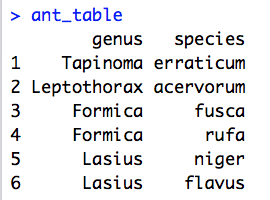

# Computing in R - Practical 2

BIO309: Research Methods and Communication

October 2017

Building on your existing skills, we will now move on to consider advanced ways of controlling program flow. Specifically, we will explore **functions** and **loops**, two important features of R that are also present in most other programming languages. We will also be doing a few exercises with DNA/RNA strings. As always, you will want to refer frequently to the R help files (through `?`) and your own notes when exploring these new concepts.

## Functions

Functions are pieces of code that are take input information (in the form of "arguments"), do something with it, and give back an output. They allow you to run an analysis multiple times without having to rewrite it from scratch every time you need to run it. A function looks like this:

```r
function_name <- function(input) {

  ### the "body" of the function

  # code that performs some calculation on the input
  # possibly other lines of code that perform calculations

  # returning an output vector:
  return(output)
}
```

You can choose whatever name you want instead of `function_name` (try a meaningful name). After the `<-`, the word `function` lets R know that you are writing a new function. Here, `input_vec` is the name of the only argument that the calculations in the `body` of the function are based on (your function *can* have multiple arguments). Between the curly brackets `{}` is the main code of your function, where the calculation(s) happen. Almost everything that occurs between the curly brackets stays within the curly brackets. The only thing that back outside the curly brackets is what you put into the `return()` on the last line. If you have no `return()`, your function may compute something but nobody will ever no about it! Note that the `return` command can only handle a single argument.

To take a self-explanatory example:

```r
x <- c(2, 3, 4, 5)
mean(x)
```

You just used the `mean` function, one of many functions that our predecessors built into R. The point of this function is that you can calculate the mean of any vector without explicitly writing the formula for the mean each time. The interesting thing about R is that it is possible to create your own functions. This is how R functions work:

```r
## Define function named 'my_own_mean'

my_own_mean <- function(number_vec) {
  ## Calculate mean
  # Sum all numbers in the vector
  sum_of_values <- sum(number_vec)

  # Obtain the number of values in the vector
  number_of_values <- length(number_vec)

  # Get the mean
  mean_value <- sum_of_values/number_of_values

  ## Output the mean
  return(mean_value)
}

## Now run the function with some data:
my_own_mean(number_vec = c(10,20,30,40)

my_own_mean(number_vec = 1:50)

```

We created a function that computes the sum and number of all values in a given vector (`number_vec`) and then divides them to obtain the mean. We split the calculation in three steps, just to show that you can have many lines of code in the body of a function. The only input this function receives, is a vector of numbers (`number_vec`) and all the calculations are based on this. In the end we return the result of the third calculation (`mean_value`). Does `number_of_values` exist in the normal R console? No! Because this variable was only created within the curly brackets. Remember? What happens between the curly brackets stays in the curly brackets.

Nothing much happens after loading the function `my_own_mean` into R (you always have to evaluate the entire code of the function from `function_name` to the closing curly brackets `}` if you made changes to the code). The magic happens when you *call* the function. We did this by typing `my_own_mean(number_vec = 1:50)` (of course you can use other vectors instead as well). The vector with numbers from 1 to 50 will be used as `number_vec` in the function.

Now take a look at the following lines of code. This code is designed to take a number in seconds and convert it into hours, minutes, and remaining seconds (`floor()` is R's built-in function for rounding down to the closest whole number):

```r
# Input raw number of seconds
number_of_seconds <- 19955

# Convert number_of_seconds into hours, minutes, and seconds
hours   <- floor(number_of_seconds / (60 * 60))
minutes <- floor((number_of_seconds - hours * (60 * 60)) / 60)
seconds <- number_of_seconds - ((hours * 60) + minutes) * 60

# Create a single vector containing all three quantities
output_vec <- c(hours, minutes, seconds)

# Output the solution to the console
output_vec
```

#### Q1. Modify the code above to make it into a function called `time_converter`. This function should take a single number as an argument (the number of seconds we want to convert). This function should also include the three lines of code that convert `number_of_seconds` into `hours`, `minutes`, and `seconds`, the line of code that merges these three variables into one vector, and a line returning this vector as the output of the function. Once you created the function and loaded it into R, use relevant examples for testing (0, 3600, another). Remember to indent any code inside the curly brackets.

#### Q2. Write your own function for converting distances between different units. Your function should take the distance in kilometres as input and return the distance in miles as output ([1 kilometre is 0.6213712 miles](https://en.wikipedia.org/wiki/Mile)). Note: `floor` won't be needed in the calculations here. Remember to clearly comment/annotate your code and make appropriate use of whitespace including indentation and newlines.

### More complex functions

Functions can be very useful when you have to do the same calculation many times. We will now consider a hypothetical experiment in which we are measuring the flight speed of bees through flight tunnels.

We would like to measure the flight speed of the bees in meters per second. Annoyingly, the timer we used gave readings with the format `hours:minutes:seconds`, rather than just the total number of seconds.

Fortunately, functions in R can take more than one argument:

```r

my_function <- function(input1, input2, ...) {
    # code including input1, input2, ...
    return(something)
}

```

#### Q3. Make a function that takes `hours`, `minutes` and `seconds` as inputs, and outputs the total number of seconds. Make sure it has three arguments and a descriptive name. Test the function with a range of times for which you know the answer.

In our experiment, most bees flew through the test tunnel in under an hour. It is time consuming to include the argument `hours = 0` every time that we call the function.

A neat thing about functions is that we can set default values for any argument, using the syntax:

```r
my_function <- function(input1, ..., input15 = default) {
  # code including input1, input2, ..., input15
  return(something)
}
```

The default argument(s) is generally placed at the end of the argument list.

#### Q4. Make the `hours` and `minutes` arguments be defined as 0 by default in your function. Run the function without supplying these two arguments, then run it again with using a range of `hours` and `minutes`.

Finally, we would like to create a function to measure the flight speed of the bees in meters per second. This function should:

* Take the tunnel length (in meters), hours, minutes and seconds as arguments
* Use your previous function to convert hours, minutes and seconds to seconds
* Calculate the speed of the bees in meters per second
* Return the speed of the bees

#### Q5A. Create this function. Test it with a control (values for which you know the answer).

#### Q5B. Use the function to measure the speed of the bees with the following measurements:

Distance (m) | Time (hours:minutes:seconds)
---------|------
1 |00:00:08
10 |00:00:40
300 |00:05:00
800 |01:06:40

#### Q5C. Can you think of parameter values that would make your function not work properly? What happens if you try running the function with these values?

### Functions with other types of input

Note that functions do not have to take single numbers as input. They can take vectors, matrices, data frames, or any other type of object, and they can also take character and logical data as well as numerical. For example, the `mean` function we used earlier took the vector `x <- c(2, 3, 4, 5)` as input, which is a single vector with four numbers.

#### Q6. Write a function that takes a vector of words as input and outputs the number of characters in the longest word. Hint: you are going to need to find out how R counts the number of characters in words and how it finds the maximum value in a vector - use an internet search engine!

## Loops
Imagine that you need to run the function `time_converter` on different numbers. You could type `time_converter` many different times, each time with a different number. But now imagine you had to type that thousands of times. Not fun.

Fortunately, computers were built to perform same tasks over and over again many times. They do this using a construct called a *loop*. Although there are several types of loops, we are going to learn about the 'for loop'. It works this way:

```r
## For loop example
for (seconds in c(1000, 2000, 3000)) {
  time_in_hours <- time_converter(number_of_seconds = seconds)
  print(time_in_hours)
}
```

The variable `seconds` only exists within the loop. The loop will run 3 times. The first time, `seconds` will take the first value from the vector `(1000, 2000, 3000)`, i.e., `1000`. R will run through the loop, computing `time_in_hours` and printing it. When R starts running through the loop the second time, `seconds` will have the value `2000`, and the previously calculated `time_in_hours` will have been forgotten.  R will run through the loop, computing `time_in_hours` and printing it. The third time, same thing again, but `seconds` will start with the value `3000`.

### Slightly more complex loops
There are some interesting ways in which we can stretch our understanding of loops. First of all, it is important to recognise that the values that we are iterating over can be anything that goes in a vector. The vector can be defined outside the loop definition line:

```r
## Character based loop values
greetings <- c("Hey", "Hi", "Hello", "Aloha", "Howdy",
               "Yooooo!", "Wassup", "What's shakin?",
               "yello!", "Greetings",  "Dude, wake up!")
for (word in greetings) {
  print(paste(word, " - said the giggling frog", sep=" "))
}

## Sequential loop values
my_favourite_numbers <- c(42, 3.14, 7, 69, 6.626e-34, 1024, 4, 2.718281828, 666 , 1.61803398, 99)

# set the cumulative sum at zero before the loop starts
cumulative_sum <- 0

for (value in my_favourite_numbers) {
  # print the sentence
  print(paste(value, "is my favourite number", sep=" "))
  
  # add favourite numbers, sequentially
  cumulative_sum <- cumulative_sum + value
  
  # print the cumulative sum
  print(paste("The sum of my favourite numbers is:", cumulative_sum, sep=" "))
}

## Looping through the positions of each element of the vector (the index, or position)
colour_vec <- c("red","green","blue","yellow","orange","purple","pink")
for (position in 1:length(colour_vec)) {
  current_colour <- colour_vec[position]
  print(current_colour)
}

```

### Storing loop results

You will often want to do more than just print the loop results. For example, you may want to keep them in a separate variable. Check the following example. What does `phrase_vec` look like after the 4th iteration?

```r
## Vector to loop through
practical_attribute_vec <- c("great", "boring", "very long", "amazeballs!", "informative", "fun")

## Empty vector to store the loop results in
phrase_vec <- c()

for (practical_attribute in practical_attribute_vec) {
 phrase <- paste("This practical is", practical_attribute)
 # Add the loop result to end of the vector of results
 phrase_vec <- append(phrase_vec, phrase)
}
```

A different way of approaching a for loop is to loop through the positions of a vector, rather than the vector itself. In the following code, we also create a vector for the result with the same length as the vector that we are looping through. We then use the position to 'populate' it:

```r
## Vector to loop through
practical_attribute_vec <- c("great", "boring", "very long", "amazeballs!", "informative", "fun")

## Vector with empty elements (as long as practical_attribute_vec)
phrase_vec <- rep("", times = length(practical_attribute_vec))

## Loop through the position rather than the vector
for (position in 1:length(practical_attribute_vec)) {

  ## Create phrase, getting attribute from practical_attribute_vec[i]
  phrase <- paste("This practical is", practical_attribute_vec[position])

  ## Add phrase to the right position of the results vector
  phrase_vec[position] <- phrase
}
```

It is important to understand these two approaches with loops: looping through items vs. looping through positions. In some contexts it is easier to use the first approach; in other contexts the second is easier. Once you are comfortable with loops, have a go at the following tasks:

#### Pen and paper Q7. Consider the following table, which lists the genus and species name for a number of ant species present in Great Britain. The loop counts the number of entries where the genus name begins with given letters. Describe in your own words what the loop is doing at each iteration.



```
letters_vec <- c("L", "T", "A", "F")

for (letter in letters_vec){
 begins_with <- paste("^", letter, sep = "")
 matches <- grep(pattern = begins_with, x = ant_table$genus)
 print(paste(length(matches), "begin with", letter))
}
```

#### Q8. Write a loop that iterates over the colours red, green, blue, yellow, orange, purple, pink and prints out the position (ie the position of the colour in the vector) and the colour itself. This should be done in human-readable format (i.e. "the colour red is in position 1 in the vector", "the colour blue is in position 2 in the vector", and so on). Make sure to indent the code appropriately between the curly brackets.

### Using loops

For the following exercice, imagine that instead of buying a coffee, you deposit the £2.50 you would have spent into a savings account. The account has an annual interest rate of 5%, which is deposited into the account. You do not take any money out of the account for 20 years.

#### Q9. Use a `for` loop to calculate how much money there is in the account after 20 years.

#### Q10. Make a plot of the amount of money in the account per year. Hint: if you have not done so yet, you will have to create a vector to store each year's amount.

In the following exercise, we will simulate the size of a population given a reproduction rate that changes every year.

#### Q11. Write a loop that calculates the population size depending on the reproduction rate over a period of 20 years. Store the population value for each iteration of the loop in a separate vector.

* Use a starting population size of 1000.
* Create a vector containing the reproduction rate for each year: `reproduction_rate <- rnorm(20, mean = 1, sd = 0.2)`.
* Loop through the reproduction rate vector and update the population size value accordingly.
* In addition, store each year's population and plot or just print it against the year (1 to 20).

### Nested Loops

Another important way of extending loops is to consider nested loops - in other words, loops within other loops! Have a look at the following code:

```r
coffees_vec <- c("latte", "cappuccino", "flat white", "cortado")
cafes_vec   <- c("Infusion", "Ground", "Sugar Cube", "Foxcroft & Ginger", "Sweet")

for (drink in coffees_vec) {
  print(paste("I'd like a", drink, "... Where can I go?"))
  for (the_place in cafes_vec) {
  print(paste("You can go to", the_place, "to have a", drink))
  }
}
```

Here we have one loop (with position `the_place`) nested within another loop (with position `drink`). We have also defined the values that `the_place` and `drink` can take. With a pen and paper, determine what is the 1st line printed, and then what is the 10th line printed? Evaluate this code and try to make sense of the output. Fiddle around with the different elements of this code until you are comfortable with nested loops. Warning - loops require your computer to perform many operations, and as such it is quite easy to crash R using loops. A simple block of code evaluated 100,000 times amounts to quite a big job. If you want to force R to exit a loop part way through, simply press 'Esc'. Nested loops are particularly hazardous!

#### Q12-A. Create a nested loop. The outer loop should iterate over the words "Angry", "Lazy", and "Happy". The inner loop should iterate over the words "birds", "dogs", and "horses". The code inside the inner loop should print out a vector containing the values of both loops (for example "Angry" and "birds" in the first instance).

#### Q12-B. Look again at the code you wrote in Q12-A. Did you sufficiently indent your code (like in the example of a nested loop above), so that it is easy to see which lines of code are executed at which point of the different loops? If not, DO IT NOW! And continue doing it for the next questions as well.

#### Q13. Write a third-degree nested loop (i.e. a loop within a loop within a loop). Be careful not to loop over too many values or you will crash R!

(if you're short of ideas, you could for example add `practical_attribute_vec` qualifiers to Q12...)

### Using loops to reformat a data set

Loops are particularly useful to reformat data sets. By looping through all of the fields of a particular data set and at each iteration saving the relevant entry into a new data structure, it is possible to convert from one data format into another.

The data set that we will use in this example is typical of the sort of data that you might be faced with in the future. Load the data by running the following line of code:

```r
helianthus_data <- as.matrix(read.table("https://wurmlab.github.io/SBC361-programming-in-R/HelianthusData_num.txt", header = TRUE))
```

Each row in this data set represents a different strain of *Helianthus annuus* (sunflowers), grown under controlled conditions. The first column tells us the Strain (these are numbered from 1 to 5). The remaining columns describe the number of plants found in the study area at six different points in time. For example, looking at the first row, we can see that strain 1 started out with 12 plants in the first time point and ended up with 57 plants in the last time point.

We want to get this data into a new format - sometimes called long format - in which we have a matrix of three columns; the first column describes the strain, the second column describes the time point, and the third column describes the number of plants observed. It turns out that researchers often need to do this! For example, plotting using `ggplot` (and many analysis packages) requires long format. The first few lines of this new data structure should look like this:

Strain | Time | Count
-------|------|------
1 |0 |12
1 |1 |33
1 |2 |71
1 |3 |61
1 |4 |73
1 |5 |57
2 |0 |10
2 |1 |27
...|...|...

We can make the transition from the wide format of `helianthus_data` to the long format described above using a nested loop. But first, let us create an empty matrix, which we will eventually fill with our new values.

#### Q14-A. Create an empty matrix, called `long_data`. This matrix must have 3 columns and 30 rows (the number 30 comes from the fact that we have five strains at six time points each). Name the columns `c("Strain", "Time", "Count")`.

With this empty matrix created, we can move on to the next part of the problem - populating it with values. We want to look at each of the elements of helianthus_data one after the other, using a nested loop. The basic structure of this nested loop is as follows:

```r
# Loop through all rows of helianthus_data
nrow(helianthus_data)
for (number_of_rows in 1:5) {
  # Loop through all columns of helianthus_data except the first
  for (my_col in 2:7) {

    # This is where the main code goes (populating long_data with values).

  }
}
```

Here we are using loops to go through each of the rows of the matrix `helianthus_data`, and for each row we are going through columns 2 to 7 (as these are the columns that contain relevant data). At any point in the two loops, the value that we are focusing on is given by `helianthus_data[number_of_rows, my_col]`.

Hopefully you can already see that these are the exact values that we want to drop into the third column of our matrix `long_data`. However, we are presented with a problem - how do we drop these values one after the other into the right place in the matrix `long_data`? We cannot use the index `number_of_rows` to help us, as this only goes through values 1 to 5. Similarly, we cannot use the index `my_col`, as this only goes through values 2 to 7. What we really need is a new index that goes all the way from 1 to 30, irrespectively of the row or column that we are focusing on.

#### Q14-B. Change the for loop above to include a variable `my_position`. This variable should be defined as being 0 before the loop starts. At every iteration of the inner loop, you should add 1 to it. What are the values of `number_of_rows` and `my_col` when `my_position` is 3? Add a line to check the positions each time through.

It should look something like this:

```r
# my_position defined as 0 before the loop starts
my_position <- 0

# Loop through all rows
for (number_of_rows in 1:5) {
  # Loop through all columns except the first
  for (my_col in 2:7) {

    ## Change my_position here:
    # make my_position equal to my_position plus one

    # Print all the indices here to check that you are doing the right thing
  }
}
```

Now that we have three indices - one going through the rows of `helianthus_data`, one going through the columns of `helianthus_data`, and one simply going from 1 to 30 - we have all the ingredients we need to populate the matrix `long_data`. The code we need at each iteration of the loop is the following:

```r
# Get Count
long_data[my_position, 3] <- helianthus_data[number_of_rows, my_col]
```

This is fairly straightforward. We also want to drop the time point in the second column of `long_data`. Although we do not have a vector describing each of the time points, in fact the timings are very simply given by 'my_col minus two'. For example, if we are looking at the fourth column then we are looking at the second time point. Therefore, we need the following line of code to extract the timings:

```r
# Get Time
long_data[my_position, 2] <- my_col - 2
```

Finally, we want to drop the strain type into the first column of `long_data`. The strain type is given by the first element in every row, meaning it is given by `helianthus_data[number_of_rows, 1]`. Therefore, we need the following line of code to extract the strain types:

```r
# Get Strain
long_data[my_position, 1] <- helianthus_data[number_of_rows, 1]
```

#### Q14-C. Bring all of this together to finish the for loop, and run it!
To check what you've done, you can print the start and end of long_data:

```r
head(long_data)
tail(long_data)
```

#### Q14-D. What can you do to reduce the risks of things going wrong if there is a chance you may want to rerun this loop on a similar but slightly different dataset?

## Hacker section: Working with DNA data

#### Bonus Q15-A. Write a function that converts a short DNA sequence of 15 bases (e.g. "ACCTGTCATCATCCC") to RNA and splits the string into codon triplets. You will need to:

  * load the data into R: `dna_string <- scan("https://wurmlab.github.io/SBC361-programming-in-R/sequence.txt", what = character())`
  * replace T with U  (thymine with uracil to convert DNA to RNA)
  * use `substring()` to split the sequence into triplets and `seq()` within `substring()`
  * return the RNA triplets string

Note `substring()` takes a 'first' and 'last' argument. The 'first' would be a sequence indicating where the beginnings of your triplets are. The 'last' argument would be a sequence indicating where the ends of your triplets are.  In `seq()` you will also indicate you want triplets.

As an example:

```r
dna_string <- c("AAATTT")
substring(dna_string, seq(1, 4, by = 3), seq(3, 6, by = 3))
```

#### Bonus Q15-B. Once you have created the function, see if you can modify it to work for a sequence with any number of characters. Tip: you can use `nchar()` to create a variable such as `num_characters`.

#### Bonus Q16. Write a function to obtain the reverse-complement of a DNA sequence.

You can use this sequence (copy and paste it into R): `"ATTACGACGCGATTCCCGGTTAATCGAATTCCCA"`. As an example, the reverse-complement of ATGC is GCAT.

The tricky part here is reversing a single string of characters. Search around for `strsplit`.  You will need to:

* replace bases with their complement (you can use `gsub`, judiciously replacing uppercase characters with lowercase characters (or vice-versa)).
* split the string of DNA bases into separate characters with `strsplit`. Unfortunately, `strsplit` confusingly returns a list, so you will need to use `unlist()` to obtain a string again
* reverse the sequence
* remove the spaces to get your single string of DNA bases (look into the help files for the `paste()` function)
* return the reverse-complement sequence

#### Mastermind Q17. Translate your triplet string from Q15 into amino acids.
Note: depending on your method, you may not need to convert it to RNA first.  You can use a codon-to-amino-acid table and code the translation yourself. Your solution could include a function calling a function. Alternatively, you could search around and load a specific package for the manipulation of biological sequences.

## Bringing it all together

Well done for making it this far! Now try to bring all of your knowledge together. Have another look over your previous notes and make sure these ideas are still fresh in your mind. Have a go at writing your own scripts, preferably combining a number of different concepts (for example, you could try making a function that acts on a matrix and then using this function within a loop). Another good idea would be to come up with a problem that you want to solve (either for fun or for other coursework) and then write a function that solves it.

Many of the ideas presented in this and the last session are designed to challenge you. Do not expect to understand them from a single read through the material. Rather, you will have to play around with many different examples and applications before the penny drops completely. On the plus side, structures such as loops and functions are common to almost all programming languages, and so once you understand these concepts the world of programming is your oyster!
